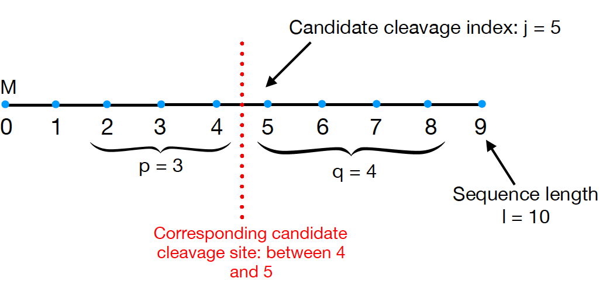

# Peptide cleavage site prediction

## Context

Given a sequence of aminoacids, we want to predict the location of its cleavage site. This can be framed as a binary classification problem: given a location in the sequence, we use the surrounding aminoacids to predict whether or not the cleavage site is located there.

For example, as in the image below, we may try to predict whether or not the cleavage site is located after the fifth aminoacid in the sequence, by looking at the ```p=3``` and ```q=4``` respectively preceding and following this position.



We are therefore looking for methods to score a window of ```p+q``` aminoacids around any candidate cleavage site. We implemented 2 such methods:

* Using the training data to create a Position Specific Scoring Matrix (PSSM). This is an *ad hoc* method, and we explain how the PSSM is built below. 

>Consider a window containing aminoacid *a* in position *i*, with *i* between *-p* and *q-1* (*cf* image above).
>* if *a* appears in position *i* especially frequently in windows surrounding cleavage sites (compared with other windows), then this should **increase the score** of the window
>* if *a* appears in position *i* especially seldom in windows surrounding cleavage sites (compared with other windows), then this should **decrease the score** of our window
>Let *f(a,i)* be the frequency of aminoacid *a* at the relative position *i* in the training set, and *g(a)* the general frequency of *a* in the training set.
>The PSSM matrix *W(a,i)* is defined by the equation: *W(a,i)* = log[*f(a,i)*] - log[*g(a)*]. Summing the *W(a,i)* for every aminoacid *a* in position *i* in the window defines the PSSM score of the window.

* Using Support Vector Machines (SVM) and the C++ library ```libsvm```.


## Running
* modify the first line of the function ```main()``` in ```src/main.cpp``` to chose the desired dataset.
* run ```make``` and ```./main``` inside the ```src``` directory and ```make clean && make``` inside the ```libsvm-3.23``` directory
* run ```./main.sh``` inside the ```src``` directory.

## Structure of our code

### Preprocessing
In this section, we describe how the raw data is transformed in order to be exploitable by our learning models:


* The function ```CreateTrainTestSets``` in class ```train_test_split``` takes the original dataset (throughout the project, we worked with ```EUKSIG_13.red```) and builds two files ```train.red``` and ```test.red```, in respective proportions 4/5 and 1/5 using a random seed.

* The class ```Sequence``` encodes a sequence of aminoacids. Each instance has three attributes: the integers ```length``` and ```cleavage_site``` contain the number of aminoacids in the sequence, and the position of the cleavage site. ```aa_sequence``` is a string containing the sequence of aminoacids.

* ```FileToSequenceArray``` converts ```.red``` files (typically ```train.red``` and ```test.red```) into arrays of instances of ```Sequence```. As we shall see below, these arrays will be used directly for training in the case of the PSSM method, or converted into ```libsvm```-compatible files in the case of SVM.


### The classes ```Predictor``` and ```PSSM```

* The abstract class ```Predictor``` contains the functions used to predict the location of the cleavage site. It is extended by the class ```PSSM```, which implements these functions in the case of the PSSM approach.

* ```train``` takes as argument a training set (an array of instances of ```Sequence```) and the number of instances it contains, and performs training (in the ```PSSM``` implementation, it simply builds the Position Specific Scoring Matrix). Once training has been completed, the following functions can be used:

* ```WindowScore``` gives the ```PSSM``` score of a given window in a sequence.

* ```FindCleavageMax``` returns the position in a sequence such that the window surrounding it maximizes the value of ```WindowScore```.

* ```FindCleavagesThreshold``` returns all the positions in a sequence such that the score of the surrounding windows exceeds some specified threshold.

* Given an array of instances of ```Sequence```, the function ```SequenceAccuracy``` returns the fraction of sequences such that ```FindCleavageMax``` returns the true position of the cleavage site of the sequence.


### Support Vector Machines
We used the library ```libsvm``` to perform SVM on the training examples. This entailed preprocessing the data so as to convert it in a format accessible by ```libsvm```. Note that at this point, the format of the data is an array of sequences, whereas the actual dataset on which we wish to train Support Vector Machines is the set of windows (rather than the set of sequences).

Hence the following functions, written directly inside ```main.cpp```, which convert the data from an array of sequences into a vector of windows (and their associated labels):

* ```SequenceToWindows``` converts the array of instances of ```Sequence``` into a vector of strings, such that each string corresponds to a window of size ```p + q```.
* ```SequenceToLabels``` converts the same array into a vector of strings, such that each string is the label of the corresponding window ("+1" or "-1" depending on whether the window's position is that of the sequence's cleavage site). 


The two following functions use the vectors created above to create ```libsvm```-compatible training and testing files:


* ```SequenceSVMTranslate``` takes as argument the vectors built by the two functions above and uses them to write into a ```.txt``` file (the name of which is also an argument) in the ```libsvm-compatible ``` ```<label> <index1>:<value1> <index2>:<value2> ...``` format

* ```SequenceSVMTranslateSimilarityMatrix``` also writes into a file (the name of which is also an argument) in a ```libsvm```-compatible data format. However, in this case the file should allow ```libsvm``` to exploit a precomputed kernel, specified in the argument ```similarity_matrix```: the format is ```<label> 0:i 1:K(xi,x1) ... L:K(xi,xL)```. We noticed that the resulting files can quickly become very heavy (> 500 MB with 267 training instances), since the size grows quadratically with the number of instances.


We wrote a bash script ```src/main.sh``` in order to facilitate training and prediction using ```libsvm```, making it easier to choose kernels and hyperparameters. 

### Directories

The project comprises three directories: ```src```, ```data```, and ```libsvm-3.23```. ```src``` is the source directory: it contains all the code we wrote, as detailed above.

The directory ```data``` contains all our data. To be more precise:

* ```data/datasets``` contains all the ```.red``` files, including ```train.red``` and ```test.red```.

* ```data/matrices``` contains the Identity and BLOSUM62 matrices in ```.txt``` format.
* ```data/models``` contains the models created by ```svm-train``` during training.

* ```data/outputs``` contains the output files created when running ```svm-predict```, both predictions for each instance and the associated scores (f-score, precision, recall, accuracy).

* ```data/test``` contains the test sets, in a format compatible with ```libsvm``` specifications.

* ```data/train``` contains the training sets, in a format compatible with ```libsvm``` specifications.


```libsvm-3.23``` is where the ```libsvm``` functions are stored. We modified it slightly, exactly as advised [here](https://www.csie.ntu.edu.tw/~cjlin/libsvmtools/eval/index.html), in order to validate our model based on better evaluation functions than the accuracy.
